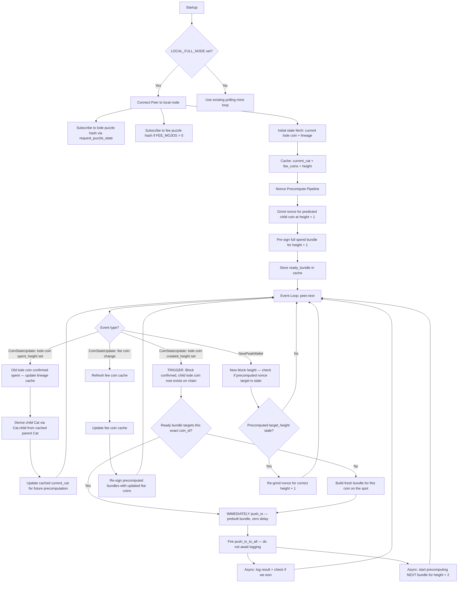
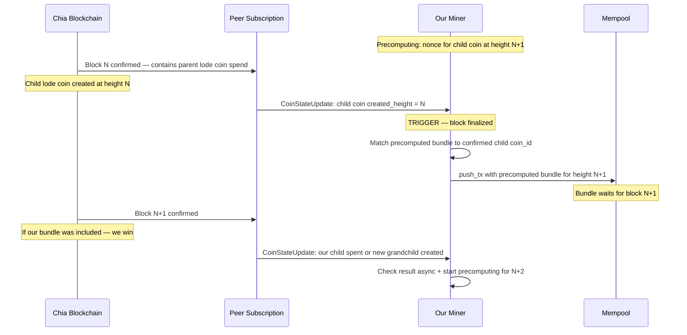

# Instant-React Mining Architecture

## Overview

Replace the polling-based mining loop with an event-driven, instant-react architecture for `LOCAL_FULL_NODE` users. When the lode coin changes state on-chain, the miner reacts within milliseconds — not seconds — by leveraging the SDK's [`Peer`](venv/lib/python3.9/site-packages/chia_wallet_sdk/__init__.pyi:1209) protocol subscriptions, precomputed nonces, cached lineage proofs, and cached fee coins.

Non-local users continue to use the existing [`mine()`](python/xkv8/xkv8r.py:438) polling loop unchanged.

## Competitive Parity Mapping

| Competitor Technique | Our Implementation |
|---|---|
| Local node | Already have `LOCAL_FULL_NODE` env var |
| WebSockets + event subs | SDK `Peer.connect()` + `request_puzzle_state(subscribe=True)` + `peer.next()` event loop |
| Precompute nonces and h+n bundles | Background nonce grinder for height+1, height+2; pre-sign bundles |
| Defer non-crit work until after push tx | Fire `push_tx` immediately on event; check results / log asynchronously |
| Lineage from cached parent coin | Cache `Cat` object from last known spend; derive child via `Cat.child()` |
| Cache fee coins, refresh only on changes | Cache fee coins at startup; refresh only when fee coin state changes or spend fails |

## Key Puzzle Constraints

From [`puzzle.clsp`](clsp/puzzle.clsp):

- **`ASSERT_HEIGHT_RELATIVE 1`** at [line 91](clsp/puzzle.clsp:91): The child coin must exist for ≥1 block before it can be spent. This means the earliest we can spend the child is the block after it is created.
- **`ASSERT_HEIGHT_ABSOLUTE user_height`** at [line 92](clsp/puzzle.clsp:92): The spend must occur at or after the declared height.
- **`ASSERT_BEFORE_HEIGHT_ABSOLUTE (+ user_height 3)`** at [line 93](clsp/puzzle.clsp:93): The spend is only valid for a 3-block window.

This means: parent spend confirmed in block N → child coin created at block N → child spendable starting at block N+1 → our precomputed spend for height N+1 is valid in blocks [N+1, N+3].

**Critical trigger**: We push our precomputed spend bundle to the mempool **the instant block N confirms** — i.e., when we receive a `CoinStateUpdate` showing the child coin was *created* on-chain with a non-null `created_height`. We do NOT react to mempool activity or unconfirmed transactions. The `CoinStateUpdate` from the Peer subscription fires only when a block finalizes, so this guarantees we act on confirmed chain state.

## Architecture



### Timing Diagram



## Detailed Design

### 1. Peer Connection + Subscription Setup

Gated entirely by `LOCAL_FULL_NODE`. Uses the SDK's [`Peer`](venv/lib/python3.9/site-packages/chia_wallet_sdk/__init__.pyi:1209), [`Connector`](venv/lib/python3.9/site-packages/chia_wallet_sdk/__init__.pyi:1202), and [`Certificate`](venv/lib/python3.9/site-packages/chia_wallet_sdk/__init__.pyi:1193) classes.

```python
cert = Certificate(cert_pem, key_pem)  # from existing _load_full_node_certs
connector = Connector(cert)
options = PeerOptions()

# Chia peer protocol port is 8444 (mainnet) or 58444 (testnet11)
peer = await Peer.connect(network_id, socket_addr, connector, options)
```

We need the **peer protocol port** (default 8444), not the RPC port (8555). The `Peer` class speaks the Chia peer protocol over WebSocket, which supports subscriptions.

**Subscribe to lode coin puzzle hash:**
```python
genesis_challenge = GENESIS_CHALLENGES[NETWORK_NAME]
block_record = await client.get_block_record_by_height(height)
header_hash = block_record.block_record.header_hash

filters = CoinStateFilters(
    include_spent=True,
    include_unspent=True,
    include_hinted=False,
    min_amount=0
)

resp = await peer.request_puzzle_state(
    [full_cat_puzzlehash],
    height - 10,  # look back a bit
    header_hash,
    filters,
    subscribe=True  # keep subscription alive
)
```

This gives us both the current state AND real-time updates via `peer.next()`.

### 2. Cached State Object

A single `MinerState` dataclass holds all cached state:

```python
@dataclass
class MinerState:
    current_cat: Optional[Cat]           # the Cat we derived from last confirmed spend
    current_height: int                   # latest known peak height
    header_hash: bytes                    # for peer subscriptions
    fee_coins: List[Coin]                # cached fee coins
    precomputed: Optional[PrecomputedBundle]  # ready to fire
```

```python
@dataclass
class PrecomputedBundle:
    target_height: int                   # the height this bundle is valid for
    target_coin_id: bytes               # the coin this bundle spends
    bundle: SpendBundle                  # fully signed, ready to push
    nonce: int
```

### 3. Nonce Precomputation Pipeline

After any successful state update, immediately start grinding the nonce for the **next** expected height:

```python
async def precompute_next_bundle(state: MinerState, ...):
    future_height = state.current_height + 1
    future_cat = state.current_cat.child(inner_puzzle_hash, future_amount)
    
    # Grind nonce in thread pool (non-blocking)
    nonce = await asyncio.get_event_loop().run_in_executor(
        executor,
        find_valid_nonce,
        inner_puzzle_hash, pk_bytes, future_height, difficulty
    )
    
    if nonce is None:
        return
    
    # Build and sign the full bundle
    bundle = build_mining_bundle(future_cat, future_height, nonce, state.fee_coins, ...)
    state.precomputed = PrecomputedBundle(
        target_height=future_height,
        target_coin_id=future_cat.coin.coin_id(),
        bundle=bundle,
        nonce=nonce
    )
```

The nonce grind runs in a `ThreadPoolExecutor` so it doesn't block the event loop.

### 4. Event Loop — Instant React

```python
async def event_loop(peer, state, clients, ...):
    while True:
        event = await peer.next()
        if event is None:
            # Peer disconnected - reconnect
            break
        
        if event.coin_state_update is not None:
            for coin_state in event.coin_state_update.items:
                if coin_state.coin.puzzle_hash == full_cat_puzzlehash:
                    await handle_lode_coin_update(coin_state, state, clients, ...)
                elif coin_state.coin.puzzle_hash == fee_puzzlehash:
                    handle_fee_coin_update(coin_state, state)
        
        if event.new_peak_wallet is not None:
            new_height = event.new_peak_wallet.height
            if new_height != state.current_height:
                state.current_height = new_height
                state.header_hash = event.new_peak_wallet.header_hash
                # If precomputed bundle is for wrong height, re-grind
                if state.precomputed and state.precomputed.target_height != new_height + 1:
                    asyncio.create_task(precompute_next_bundle(state, ...))
```

### 5. Instant Push on Block Confirmation

The **sole trigger** for pushing a spend bundle is receiving a `CoinStateUpdate` where the child lode coin has `created_height` set (non-null). This event fires only when a **block finalizes** on chain — never from mempool activity. The Chia peer protocol only sends `CoinStateUpdate` for confirmed blocks.

```python
async def handle_lode_coin_update(coin_state, state, clients, ...):
    # TRIGGER: A new lode coin was CONFIRMED on-chain in a finalized block.
    # coin_state.created_height is set = this coin now exists on chain.
    # coin_state.spent_height is None = this coin is unspent and available to mine.
    if coin_state.created_height is not None and coin_state.spent_height is None:
        coin = coin_state.coin
        
        # Do we have a precomputed bundle for this exact coin?
        if (state.precomputed
            and state.precomputed.target_coin_id == coin.coin_id()):
            # FIRE IMMEDIATELY — block just confirmed, push prebuilt bundle
            # Our bundle targets height created_height+1, which is the
            # earliest valid height due to ASSERT_HEIGHT_RELATIVE 1.
            asyncio.create_task(push_and_log(clients, state.precomputed.bundle))
        else:
            # Build fresh — still faster than polling since we skip RPC lookups
            asyncio.create_task(build_and_push_fresh(coin, state, clients, ...))
        
        # Update cached Cat for next round of precomputation
        state.current_cat = state.current_cat.child(inner_puzzle_hash, coin.amount)
        
        # Immediately start precomputing the NEXT bundle (for height + 2)
        asyncio.create_task(precompute_next_bundle(state, ...))
    
    # A lode coin was spent (confirmed in a block) — someone mined it
    elif coin_state.spent_height is not None:
        # Check if it was us — do this asynchronously, not on the hot path
        asyncio.create_task(check_mining_result_async(coin_state, ...))
```

### 6. Fee Coin Caching

At startup, fetch all fee coins and cache them. Only refresh when:
- A `CoinStateUpdate` reports a fee coin change
- A `push_tx` fails with a coin-not-found error

```python
def handle_fee_coin_update(coin_state, state):
    coin = coin_state.coin
    if coin_state.spent_height is not None:
        # Fee coin was spent - remove from cache
        state.fee_coins = [c for c in state.fee_coins if c.coin_id() != coin.coin_id()]
    elif coin_state.created_height is not None:
        # New fee coin appeared - add to cache
        state.fee_coins.append(coin)
```

Subscribe to fee puzzle hash alongside the lode puzzle hash if `FEE_MOJOS > 0`.

### 7. Improved push_tx Error Handling

The current [`push_tx_to_all()`](python/xkv8/xkv8r.py:412) catches generic `Exception` from the Rust SDK's reqwest layer. Improve it to:

1. **Parse structured errors** from [`PushTxResponse.error`](venv/lib/python3.9/site-packages/chia_wallet_sdk/__init__.pyi:1994) when available
2. **Distinguish transport errors** — reqwest failures, from **mempool rejections** — `DOUBLE_SPEND`, `COIN_NOT_YET_SPENT`, etc.
3. **Return a richer result type** so callers can react differently

```python
@dataclass
class PushTxResult:
    success: bool
    status: Optional[str]
    error: Optional[str]
    error_category: str  # 'success', 'mempool_conflict', 'transport', 'unknown'

async def push_tx_to_all(clients, bundle) -> PushTxResult:
    results = await asyncio.gather(
        *[client.push_tx(bundle) for client in clients],
        return_exceptions=True
    )
    
    for res in results:
        if isinstance(res, BaseException):
            # Transport / reqwest error - extract useful message
            error_msg = str(res)
            # Try to extract the inner error from reqwest wrapper
            continue
        if res.success:
            return PushTxResult(True, res.status, None, 'success')
    
    # All failed - classify the primary result
    primary = results[0]
    if isinstance(primary, BaseException):
        return PushTxResult(False, None, str(primary), 'transport')
    
    error_str = primary.error or ''
    if any(kw in error_str for kw in ['DOUBLE_SPEND', 'ALREADY_INCLUDING']):
        category = 'mempool_conflict'
    elif 'COIN_NOT_YET' in error_str:
        category = 'coin_not_ready'
    else:
        category = 'unknown'
    
    return PushTxResult(False, primary.status, error_str, category)
```

### 8. Lineage Derivation Without RPC

Currently, every mining attempt calls [`get_coin_record_by_name()`](python/xkv8/xkv8r.py:571) and [`get_puzzle_and_solution()`](python/xkv8/xkv8r.py:577) to reconstruct CAT lineage. This is 2 RPC round-trips on the hot path.

With `Cat.child()` from the SDK, we derive the child `Cat` object directly from the parent `Cat` — **zero RPC calls**:

```python
# Instead of 2 RPC calls:
future_cat = current_cat.child(inner_puzzle_hash, future_amount)
# future_cat has: .coin, .lineage_proof, .info — everything needed
```

The only time we need RPC lineage lookup is at **startup** to bootstrap the first `Cat` object.

### 9. Entry Point Changes

```python
async def mine():
    # ... existing setup ...
    
    if LOCAL_FULL_NODE is not None:
        # Try Peer-based instant-react mining
        try:
            await mine_instant_react(clients, ...)
        except Exception as e:
            print(f"Peer connection failed: {e}, falling back to polling")
    
    # Fallback: existing polling loop (unchanged)
    await mine_polling(clients, ...)
```

The existing `mine()` logic moves into `mine_polling()` with zero changes. `mine_instant_react()` is the new event-driven path.

## New Environment Variables

| Variable | Default | Description |
|---|---|---|
| `PEER_PORT` | `8444` for mainnet, `58444` for testnet11 | Chia peer protocol port. Only used when `LOCAL_FULL_NODE` is set. |

## File Changes

All changes in [`python/xkv8/xkv8r.py`](python/xkv8/xkv8r.py):

1. **New imports**: `Certificate`, `Connector`, `Peer`, `PeerOptions`, `CoinStateFilters`, `Event`, `CoinState` from the SDK
2. **New dataclasses**: `MinerState`, `PrecomputedBundle`, `PushTxResult`
3. **New function: `mine_instant_react()`** — Peer subscription + event loop
4. **New function: `precompute_next_bundle()`** — background nonce grinding + bundle signing
5. **New function: `handle_lode_coin_update()`** — instant react on coin state change
6. **New function: `handle_fee_coin_update()`** — fee coin cache maintenance
7. **New function: `build_mining_bundle()`** — extracted from inline code in `mine()`, reusable for both precomputed and fresh bundles
8. **Refactored: `push_tx_to_all()`** — richer error classification and return type
9. **Renamed: `mine()`** body → `mine_polling()` — the existing polling logic, unchanged
10. **Updated: `mine()`** — dispatches to `mine_instant_react()` or `mine_polling()` based on `LOCAL_FULL_NODE`

## Edge Cases

| Case | Handling |
|---|---|
| Peer disconnects | Reconnect with backoff; fall back to polling temporarily |
| Height skips forward multiple blocks | Discard stale precomputed bundles; recompute for current+1 |
| Epoch boundary between current and next height | `precompute_next_bundle` uses `get_epoch(future_height)` |
| Fee coins spent externally | `CoinStateUpdate` removes from cache; re-sign precomputed bundle |
| Multiple lode coins in flight | Focus on highest-amount coin, same as current logic |
| Precomputed nonce not found in time | Fall back to building fresh on event |
| ASSERT_HEIGHT_RELATIVE 1 prevents early spend | We only submit when the child coin appears in a CoinStateUpdate, guaranteeing it exists |
| push_tx transport error from reqwest | Classified as 'transport' in PushTxResult; retry or log clearly |
| push_tx mempool conflict | Classified as 'mempool_conflict'; competitor beat us, log and move on |

## Expected Performance

| Metric | Current Polling | Instant React |
|---|---|---|
| Reaction time to new lode coin | 5s polling interval | Sub-second via Peer event |
| RPC calls per mining attempt | 4-5 calls on hot path | 0 calls if precomputed hits cache |
| Nonce grinding | On-demand after coin discovery | Pre-ground while waiting for event |
| Fee coin lookup | Every attempt via RPC | Cached, updated via subscription |
| Lineage proof | 2 RPC calls per attempt | Derived from cached Cat.child |
