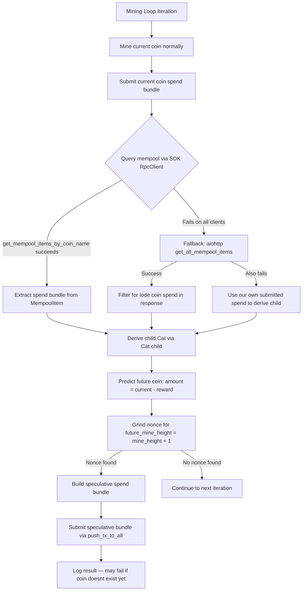

# Speculative Mining: Mine the Next Lode Coin Before It Exists

## Overview

After mining the current lode coin (or observing someone else's pending spend in the mempool), predict the **next** lode coin and submit a speculative mining spend for it at `height + 1`. Since the XKV8 puzzle is self-reproducing with deterministic parameters, the child coin's ID and amount are fully predictable.

## Key Insight

The puzzle's `emit_conditions` at [line 105 of `puzzle.clsp`](clsp/puzzle.clsp:105) always creates a self-recreation coin:

```clsp
(list CREATE_COIN my_inner_puzzlehash (- my_amount reward) (list my_inner_puzzlehash))
```

This means:
- **Child puzzle_hash** = same `full_cat_puzzlehash` — always identical
- **Child amount** = `current_amount - reward` — deterministic from epoch
- **Child parent** = current coin's ID — known
- **Child coin ID** = `sha256(parent + puzzle_hash + amount)` — **fully deterministic**

## Architecture



## Detailed Design

### Step 1: Mine Current Coin Normally — no changes

The existing [`mine()`](python/xkv8/xkv8r.py:438) function continues to mine the current lode coin as before.

### Step 2: After Successful Submission, Query the Mempool

After a successful [`push_tx_to_all()`](python/xkv8/xkv8r.py:412) at [line 738](python/xkv8/xkv8r.py:738), query the mempool for spends consuming the current lode coin.

**Primary — SDK [`get_mempool_items_by_coin_name()`](venv/lib/python3.9/site-packages/chia_wallet_sdk/__init__.pyi:1900):**

Works on both local full node and Coinset clients. Iterate through all `clients` until one succeeds:

```python
for c in clients:
    try:
        res = await c.get_mempool_items_by_coin_name(coin_id_key)
        if res.success and res.mempool_items:
            # Found mempool items — use first spend bundle
            break
    except Exception:
        continue
```

**Fallback — raw `aiohttp` call to `get_all_mempool_items`:**

If the SDK method fails on all clients, fall back to a direct HTTP POST to the Chia full node RPC endpoint `get_all_mempool_items`. This endpoint is not exposed in the SDK but is part of the standard Chia full node API. We filter the response locally for spends referencing our lode coin.

**Last resort — derive from our own spend:**

If both mempool queries fail, we already know the child from our own spend: we have `target_cat`, `reward`, and `cr.coin.amount`.

### Step 3: Derive the Future Child Coin

Use the SDK's [`Cat.child(p2PuzzleHash, amount)`](venv/lib/python3.9/site-packages/chia_wallet_sdk/__init__.pyi:1370) method on `target_cat`:

```python
future_amount = cr.coin.amount - reward
future_cat = target_cat.child(inner_puzzle_hash, future_amount)
```

This returns a [`Cat`](venv/lib/python3.9/site-packages/chia_wallet_sdk/__init__.pyi:1363) object with:
- `coin`: the predicted future [`Coin`](venv/lib/python3.9/site-packages/chia_wallet_sdk/__init__.pyi:450) with correct `parent_coin_info`, `puzzle_hash`, and `amount`
- `lineage_proof`: the correct [`LineageProof`](venv/lib/python3.9/site-packages/chia_wallet_sdk/__init__.pyi:433) referencing the current coin as parent
- `info`: the same [`CatInfo`](venv/lib/python3.9/site-packages/chia_wallet_sdk/__init__.pyi:1372)

### Step 4: Mine the Future Coin at Height + 1

```python
future_mine_height = mine_height + 1
future_epoch = get_epoch(future_mine_height)
future_reward = get_reward(future_epoch)
future_difficulty = get_difficulty(future_epoch)

future_nonce = find_valid_nonce(
    inner_puzzle_hash, pk_bytes, future_mine_height, future_difficulty
)
```

### Step 5: Build and Submit Speculative Spend Bundle

Construct the spend bundle identically to the current mining logic — lines [601-716](python/xkv8/xkv8r.py:601) — but using:
- `future_cat` as the CAT to spend
- `future_mine_height` as the `user_height` in the solution
- `future_amount` as `my_amount`
- The freshly ground `future_nonce`

Sign with the same `sk` against the future coin's ID and genesis challenge.

**Fee handling:** Skip fees for speculative attempts to avoid double-spend conflicts with the fee coins used in the current spend.

### Step 6: Handle the Result

The mempool **may reject** the speculative spend because the coin does not yet exist. This is expected and the primary purpose of the experiment.

## Code Changes Summary

All changes are in [`python/xkv8/xkv8r.py`](python/xkv8/xkv8r.py):

1. **Add `import aiohttp`** at top of file for the `get_all_mempool_items` fallback
2. **New helper: `query_mempool_for_lode_coin()`** — tries SDK `get_mempool_items_by_coin_name` on each client, falls back to aiohttp `get_all_mempool_items`
3. **New helper: `attempt_speculative_mine()`** — encapsulates: mempool query → child derivation → nonce grinding → bundle construction → submission
4. **Call `attempt_speculative_mine()`** inside the `if success:` block at [line 743](python/xkv8/xkv8r.py:743) after successful current-coin submission
5. **Reuse existing functions**: [`find_valid_nonce()`](python/xkv8/xkv8r.py:236), [`get_epoch()`](python/xkv8/xkv8r.py:199), [`get_reward()`](python/xkv8/xkv8r.py:204), [`get_difficulty()`](python/xkv8/xkv8r.py:208), [`push_tx_to_all()`](python/xkv8/xkv8r.py:412)
6. **Graceful error handling** — all speculative code wrapped in try/except, logged as experimental

## Edge Cases

| Case | Handling |
|------|----------|
| SDK mempool query fails on all clients | Fallback to aiohttp get_all_mempool_items |
| get_all_mempool_items also fails | Derive child from our own submitted spend |
| Mempool has multiple competing spends | All produce same child coin since puzzle is deterministic; pick any |
| Speculative spend rejected — coin not found | Log warning, continue normally |
| Height changes before speculative nonce found | Discard attempt; next iteration tries again |
| Current coin already spent on-chain | Child already exists; normal mining picks it up |
| Epoch boundary between current and next height | Use `get_epoch(future_mine_height)` for correct reward/difficulty |
| Fee coin reuse conflict | Skip fees for speculative attempts |

## Expected Behavior

- **Best case:** The speculative spend enters the mempool and is included in the very next block after the current coin is mined, giving a one-block head start over competitors.
- **Likely case:** The mempool rejects the spend because the coin doesnt exist yet. But we learn how the mempool handles forward-looking spends.
- **Fallback:** If speculative mining fails entirely, normal mining continues unaffected — all speculative code is purely additive and wrapped in error handling.
